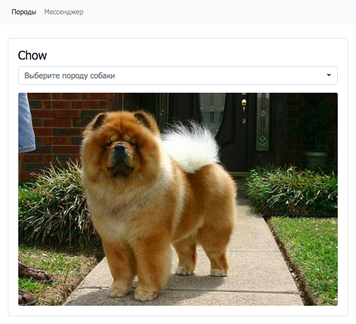
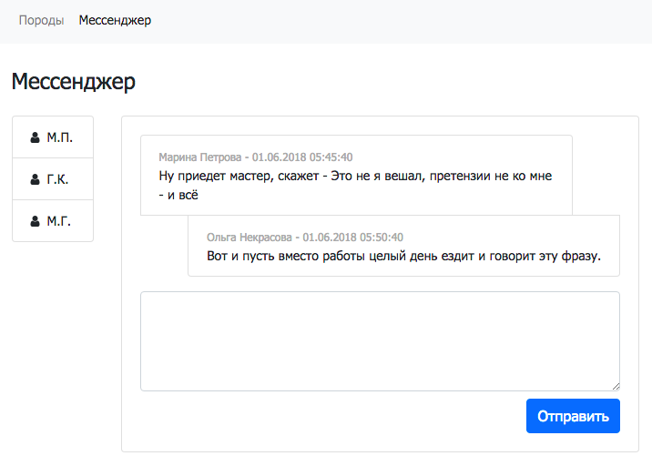

## Dogs random images & simple messenger

The project contains 2 applications:  
* the first application shows a random picture of the selected dog's breed
* the second application is a simple messenger based on a static database 




### Usage

**Make sure you have Node version >= 5.0 and NPM >= 3**

```bash
# Clone repository
git clone https://github.com/grint/dogs-and-chat.git dogs-and-chat
cd dogs-and-chat

# Install the dependencies with npm**
npm install

# Start the development webpack server (http://localhost:3000/)
npm start
```

**Go to [`http://localhost:3000`](http://localhost:3000) in your browser.**

### Production

```bash
# Build files
# Generate a production build for the project, which will be inserted into "dist/"
npm build

# Run a live-server instance off of the "dist/" directory (http://localhost:8181/)
npm server
```

## File Structure

```
project/
 ├──config/                        * All configuration
 │   │
 │   build/ 
 │   │   ├──webpack.common.js      * webpack configuration files
 │   │   ├──webpack.dev.js      
 │   │   └──webpack.prod.js      
 │   │
 │   server/                       
 │   │   └──prod-server.js         * settings for production live-server
 │   │
 │   ├──helpers.js                 * Helper functions for build scripts
 │   ├──ts.config.json             * TypeScript settings
 │   └──tslint.json
 │
 ├──src/                           * Source files that will be compiled to javascript
 |   ├──app.module.ts              * Main entry file for the application
 │   │
 |   ├──index.html                 * Where index page and main HTML wrapper will be generated
 │   │
 │   components/                   * All components of the application
 │   │   ├──name.component.ts      * Controller with constructor and methods of the component
 │   │   ├──name.server.ts         * REST requests
 │   │   ├──name.component.pug     * Pug template of the component
 │   │   └──name.component.scss    * Component's specific stylesheets
 │   │
 │   common/                       * Shared parts used in multiple components
 │   │
 │   ├──data/                      * local JSON data used in the Messenger application
 │   ├──css/                       * all global stylesheets are served here
 │   └──js/                        * static scripts are served here
 │
 ├──.babelrc                       * version of JS to generate with Babel
 ├──.bootstraprc                   * bootstrap-loader settings
 ├──postcss.config.js              * settings for PostCSS package
 ├──package.json                   * what npm uses to manage it's dependencies
 └──webpack.config.js              * webpack main configuration file
```

# Tech Stack

### Packaging & development

**Webpack**  
Module bundler  
Reference: [https://www.npmjs.com/package/webpack](https://www.npmjs.com/package/webpack)

**webpack-dev-server**  
Development server that provides live reloading.  
References:  
[https://www.npmjs.com/package/webpack-dev-server](https://www.npmjs.com/package/webpack-dev-server)  
[http://webpack.github.io/docs/configuration.html#devserver](http://webpack.github.io/docs/configuration.html#devserver)  
[http://webpack.github.io/docs/webpack-dev-server.html](http://webpack.github.io/docs/webpack-dev-server.html)


### JS

**Babel**  
Compiles ES6 and ES7 into ES5 code.  
References:  
[https://www.npmjs.com/package/babel-core](https://www.npmjs.com/package/babel-core)  
[https://www.npmjs.com/package/babel-loader](https://www.npmjs.com/package/babel-loader)  
[https://www.npmjs.com/package/babel-preset-es2015](https://www.npmjs.com/package/babel-preset-es2015)


### HTML

**raw-loader**  
Lets import HTML as a string through JS.  
[https://github.com/webpack-contrib/raw-loader](https://github.com/webpack-contrib/raw-loader)  

**html-webpack-plugin**  
Renders index.html and injects all assets to it.  
Reference: [https://github.com/jantimon/html-webpack-plugin](https://github.com/jantimon/html-webpack-plugin)

**ng2-select**  
Angular based replacement for select boxes with search field
Reference: [https://github.com/valor-software/ng2-select](https://github.com/valor-software/ng2-select)


### CSS

**bootstrap-loader** 
Load Bootstrap styles and scripts in Webpack bundle.  
Reference: [https://github.com/shakacode/bootstrap-loader](https://github.com/shakacode/bootstrap-loader)

**font-awesome-loader** 
Webpack Loader for Font Awesome Using Sass.  
Reference: [https://github.com/shakacode/font-awesome-loader](https://github.com/shakacode/font-awesome-loader)

**node-sass + sass-loader + css-loader**  
Loads a SASS/SCSS file and compiles it to CSS.  
Reference: [https://www.npmjs.com/package/node-sass](https://www.npmjs.com/package/node-sass)  
Reference: [https://www.npmjs.com/package/sass-loader](https://www.npmjs.com/package/sass-loader)
Reference: [https://www.npmjs.com/package/css-loader](https://www.npmjs.com/package/css-loader)

**autoprefixer**  
PostCSS plugin to parse CSS and add vendor prefixes to CSS rules using values from "Can I Use".  
Reference: [https://github.com/postcss/autoprefixer](https://github.com/postcss/autoprefixer)

**postcss-loader**  
Postprocess CSS with PostCSS plugins.  
Reference: [https://github.com/postcss/postcss-loader](https://github.com/postcss/postcss-loader)

**extract-text-webpack-plugin**  
Extracts CSS files in production builds.  
Reference: [https://github.com/webpack-contrib/extract-text-webpack-plugin](https://github.com/webpack-contrib/extract-text-webpack-plugin)

**style-loader, to-string-loader**  
Takes CSS and inserts it into the page via <style> tag.  
Reference: [https://github.com/webpack/style-loader](https://github.com/webpack/style-loader)
Reference: [https://github.com/gajus/to-string-loader](https://github.com/gajus/to-string-loader)


### Build

**Copy Webpack Plugin**  
Copies individual files or entire directories to the build directory.  
Reference: [https://github.com/kevlened/copy-webpack-plugin](https://github.com/kevlened/copy-webpack-plugin)

**file-loader**  
Copy assets files to output.  
Reference: [https://github.com/webpack/file-loader](https://github.com/webpack/file-loader)


### Documentation

**Markdown**  
Javascript Markdown to HTML converter  
Reference: [http://showdownjs.github.io/showdown](http://showdownjs.github.io/showdown)


## ToDo

* Add tests
* Add simple local database (e.g. localForage)
* More user data (e.g. avatar)
* Securely sign up and log in with password
* User account page
* Include JS functions documentation to component docs
* Upgrade design, add loaders

